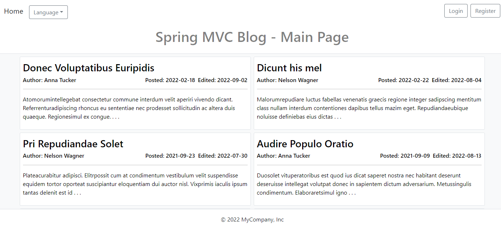

# Simple demo blog - Spring Boot - Thymeleaf - Gradle project

||
|-----|

  
Simple demo blog with basic functionality such as basic authentication, create new users and full CRUD (Create, Retrieve, Update, Delete)
operations on posts and comments.

### Installation

Download source code as zip, unzip archive or `git pull https://github.com/hmurij/TBC`.
Navigate to project folder and run `gradlew bootRun` command.

### Access the application

Access application on http://localhost:8080. Blog is pre-populated with demo data on application start. Create new user or login with any
author full name,
password is `password`, administrator username: `admin` password: `admin`.
